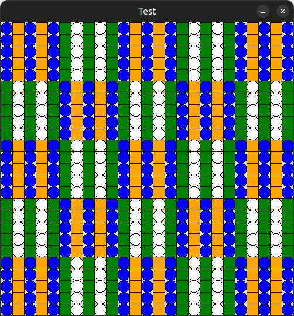

# Python coursework 2022-23 example

To prepare you for the Python coursework, Nadim has provided this program which you can use as an example only.
Either clone the repository or download the zip file and extract it to your computer.
Next run `program.py` in your editor of choice or run the following command in terminal:

```bash
python3 program.py
```

# Stage 1

Only the code for stage 1 is uncommented in `program.py`:

```py
def main():
    screenSize = 500
    win = GraphWin("Test", screenSize, screenSize)
    colours = ["blue", "green", "orange", "white"]
    alternateFlag = True

    # STEP 1
    tlPoint = Point(0, 0)
    patch1(win, colours, tlPoint)
    # patch2(win, colours, tlPoint)

    # STEP 2
    # for i in range(4):
    #     tlPoint = win.getMouse()
    #     patch1(win, colours, tlPoint)
    #     tlPoint = win.getMouse()
    #     patch2(win, colours, tlPoint)

    # STEP 3
    # for y in range(0, screenSize, 100):
    #     for x in range(0, screenSize, 100):
    #         tlPoint = Point(x, y)
    #         if alternateFlag:  # if y  == 0 or x == 0   #or x == 400 or y == 400:
    #             patch2(win, colours, tlPoint)
    #         else:
    #             patch1(win, colours, tlPoint)
    #         alternateFlag = not alternateFlag
    win.getMouse()
```

This will only draw a patch on the top left of the screen.

# Stage 2

At stage 2, the program will draw patches at the mouse click position.
Note how patches 1 and 2 are switched between clicks.
To run this stage, comment stage 1 and uncomment the lines for stage 2 as shown below:

```py
def main():
    screenSize = 500
    win = GraphWin("Test", screenSize, screenSize)
    colours = ["blue", "green", "orange", "white"]
    alternateFlag = True

    # STEP 1
    # tlPoint = Point(0, 0)
    # patch1(win, colours, tlPoint)
    # patch2(win, colours, tlPoint)

    # STEP 2
    for i in range(4):
        tlPoint = win.getMouse()
        patch1(win, colours, tlPoint)
        tlPoint = win.getMouse()
        patch2(win, colours, tlPoint)

    # STEP 3
    # for y in range(0, screenSize, 100):
    #     for x in range(0, screenSize, 100):
    #         tlPoint = Point(x, y)
    #         if alternateFlag:  # if y  == 0 or x == 0   #or x == 400 or y == 400:
    #             patch2(win, colours, tlPoint)
    #         else:
    #             patch1(win, colours, tlPoint)
    #         alternateFlag = not alternateFlag
    win.getMouse()
```

# Stage 3

At stage 3, the program will draw the following patchwork (shown in `output.png`):



To run this stage, make sure your `main` function looks like this:

```py
def main():
    screenSize = 500
    win = GraphWin("Test", screenSize, screenSize)
    colours = ["blue", "green", "orange", "white"]
    alternateFlag = True

    # STEP 1
    # tlPoint = Point(0, 0)
    # patch1(win, colours, tlPoint)
    # patch2(win, colours, tlPoint)

    # STEP 2
    # for i in range(4):
    #     tlPoint = win.getMouse()
    #     patch1(win, colours, tlPoint)
    #     tlPoint = win.getMouse()
    #     patch2(win, colours, tlPoint)

    # STEP 3
    for y in range(0, screenSize, 100):
        for x in range(0, screenSize, 100):
            tlPoint = Point(x, y)
            if alternateFlag:  # if y  == 0 or x == 0   #or x == 400 or y == 400:
                patch2(win, colours, tlPoint)
            else:
                patch1(win, colours, tlPoint)
            alternateFlag = not alternateFlag
    win.getMouse()
```
